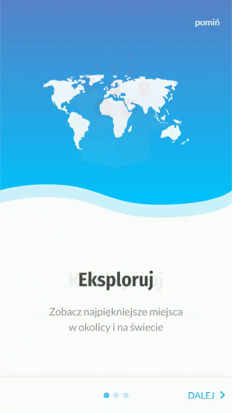
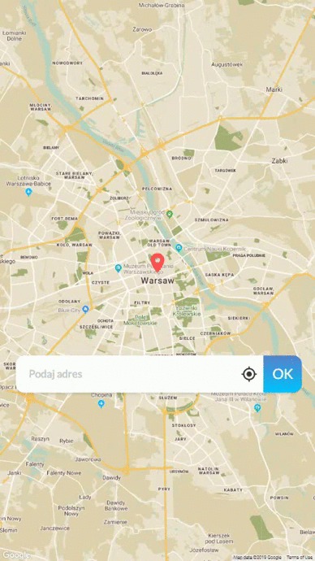
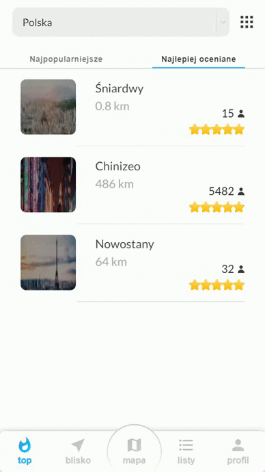

# react-venture
Yarn PWA using Firebase and Google Maps API. It was created with the help of UI designer [Patryk Korzeniecki](https://pl.linkedin.com/in/patrykkorzeniecki) as a hobby.

## Demo
  

## Dependencies
- [styled-components](https://www.npmjs.com/package/styled-components)
- [react-router-dom](https://www.npmjs.com/package/react-router-dom)
- [prop-types](https://www.npmjs.com/package/prop-types)
- [google-maps-react](https://www.npmjs.com/package/google-maps-react)
- [react-google-autocomplete](https://www.npmjs.com/package/react-google-autocomplete)
- [react-transition-group](https://www.npmjs.com/package/react-transition-group)
- [react-addons-css-transition-group](https://www.npmjs.com/package/react-addons-css-transition-group)
- [react-redux](https://www.npmjs.com/package/react-redux)
- [firebase](https://www.npmjs.com/package/firebase)
- [react-ink](https://www.npmjs.com/package/react-ink)
- [react-rating](https://www.npmjs.com/package/react-rating)
- [react-select](https://www.npmjs.com/package/react-select)
- [react-slick](https://www.npmjs.com/package/react-slick)
- [slick-carousel](https://www.npmjs.com/package/slick-carousel)
- [react-spinners](https://www.npmjs.com/package/react-spinners)
- [react-swipeable-views](https://github.com/oliviertassinari/react-swipeable-views)
- [bootstrap-styled](https://www.npmjs.com/package/bootstrap-styled)
- [material-ui/core](https://www.npmjs.com/package/@material-ui/core)
